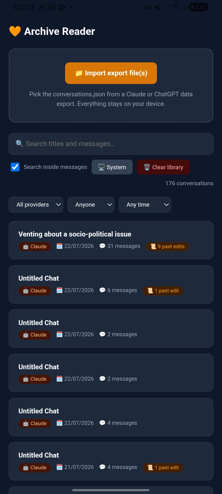
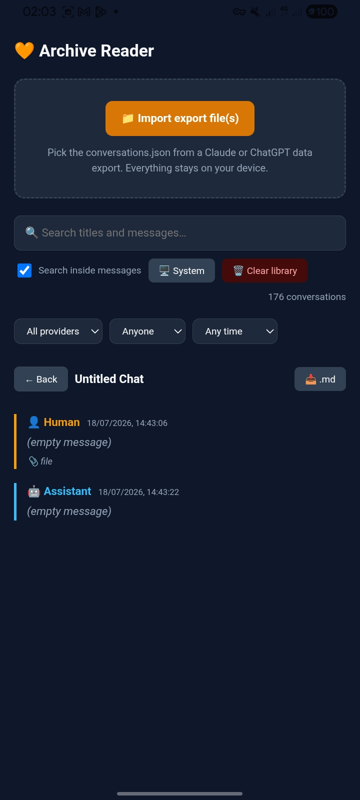

# Archivist

> **Your AI conversation history, readable and searchable on your own device.**

**Archivist** is an open-source, local-first Android app — currently shown on-device as **Archive Reader** — for reading and managing AI chat exports.

Import `conversations.json` files from **Claude** and **ChatGPT**, browse conversations in a normal interface, search across titles and messages, preserve edited conversation branches, and export readable Markdown. Imported conversation data is processed and stored locally on your device.

[](https://www.android.com/)
[](https://capacitorjs.com/)
[](https://github.com/Kuda2048/Archivist/releases/tag/latest-debug)

**[Download the latest rolling Android build](https://github.com/Kuda2048/Archivist/releases/tag/latest-debug)**

> [!NOTE]
> Archivist is currently in **pre-adoption development**. The rolling build is usable and publicly available, but it should still be treated as alpha/debug software.

---

## Screenshots


<p align="center">
  
  
</p>

---

## Why Archivist?

AI platforms let you export your data, but those exports are designed primarily as data archives rather than pleasant reading experiences.

Archivist turns supported exports into a local conversation library you can actually browse and search.

The project is built around a few goals:

- **Readable:** view exported conversations in a normal chat-oriented interface.
- **Searchable:** use SQLite FTS5 full-text search across your archive.
- **Branch-aware:** reconstruct edited conversation branches instead of flattening them away.
- **Local-first:** imported conversation data is stored on-device.
- **Provider-independent:** provider-specific importers normalize exports into one common internal schema.
- **Portable:** export individual conversations as readable Markdown.

---

## Features

- Import **Claude** `conversations.json`
- Import **ChatGPT** `conversations.json`
- Import multiple export files at once
- Re-import newer exports without duplicating existing conversations
- Reconstruct and display edited conversation branches
- Search conversation titles and message contents
- Filter conversations by provider, author, and time
- Store the archive locally in SQLite
- Fast full-text search with SQLite FTS5
- Export conversations to Markdown
- Browser preview mode for testing the UI and importers without Android

---

## Supported providers

| Provider | Import | Edit branches | Full-text search | Status |
|---|:---:|:---:|:---:|---|
| Claude | ✅ | ✅ | ✅ | Supported |
| ChatGPT | ✅ | ✅ | ✅ | Supported |
| Gemini | — | — | — | Planned / not yet implemented |

Provider-specific importers normalize exports into a shared internal conversation/message schema, so the UI does not need to understand each provider's raw export format.

---

## Privacy

Archivist is designed to keep your archive under your control.

Imported conversations are parsed, indexed, and stored locally. The Android app uses SQLite for persistent storage and FTS5 for full-text search.

**Archivist does not require your AI account credentials to read an export.**

> [!IMPORTANT]
> Data imported into the browser preview is kept only in memory and disappears when the page is refreshed. Persistent storage is available in the Android app.

---

## Install on Android

### Requirements

- Android **9 Pie (API 28)** or newer
- Current builds target/compile against **SDK 35 (Android 15)**

### Rolling APK

Every push to `main` runs a GitHub Actions workflow that builds the current debug APK.

The easiest way to install it:

1. Open the [Latest debug build](https://github.com/Kuda2048/Archivist/releases/tag/latest-debug).
2. Download `archivist-debug.apk`.
3. Open the APK on your Android device.
4. Allow installation from your browser/file manager if Android asks.

No GitHub account is required to download the release APK.

Because this is currently a rolling debug build, expect changes and occasional breakage between builds.

### Actions artifact

A build is also available from:

**Actions → Build APK → latest run → Artifacts → `archive-reader-debug`**

GitHub downloads this artifact as a ZIP and requires you to be signed in. Extract it first, then install the `app-debug.apk` inside.

---

## Import your data

### Claude

1. Open Claude.
2. Go to **Settings → Privacy → Export data**.
3. Download the export from the link sent to you.
4. Unzip it.
5. Select `conversations.json` in Archivist.

### ChatGPT

1. Open ChatGPT.
2. Go to **Settings → Data controls → Export data**.
3. Download and unzip the export.
4. Select `conversations.json` in Archivist.

You can select multiple files during import. Re-importing a newer export replaces conversations Archivist already knows about instead of creating duplicate copies.

---

## Architecture

Archivist is a Capacitor Android application with a web-based UI and a small provider-normalization layer.

```text
capacitor.config.json        Capacitor app config
package.json                 Dependencies

www/
  index.html                 App shell
  css/
    app.css                  UI styling
  js/
    app.js                   Library, search, reader, Markdown export
    db.js                    SQLite + FTS5 storage
                              In-memory fallback for browser preview
    tree.js                  Shared edit-branch reconstruction
    importers/
      index.js               Importer registry + provider auto-detection
      claude.js              Claude export → normalized schema
      chatgpt.js             ChatGPT export → normalized schema
```

Each importer converts provider-specific export data into a shared schema based around conversations and messages:

```text
conversation

message
├── id
├── parent_id
├── role
├── text
└── created_at
```

The rest of the app reads that normalized representation rather than provider-specific JSON.

This separation is intended to make additional export formats easier to support without rewriting the reader and search UI.

---

## Quick browser preview

You can test the interface and importers without building the Android app.

Open:

```text
www/index.html
```

in a desktop browser and import a supported export file.

Browser preview mode uses the in-memory backend, so imported data disappears when the page is refreshed. It is intended for quick development and testing rather than permanent archive storage.

---

## Build from source

### Prerequisites

Install:

1. [Node.js LTS](https://nodejs.org/)
2. [Android Studio](https://developer.android.com/studio)

Then clone the repository and run:

```bash
npm install
npx cap sync
npx cap open android
```

The native `android/` project is already committed with:

- minimum SDK: **28 / Android 9**
- target SDK: **35 / Android 15**
- compile SDK: **35 / Android 15**

You do **not** need to run:

```bash
npx cap add android
```

In Android Studio, connect a device with USB debugging enabled or start an emulator, then press **Run**.

After changing files under `www/`, sync them back into the native project:

```bash
npx cap sync && npx cap open android
```

---

## Roadmap

Archivist is still early in development. Current areas of interest include:

- Android **Open with… / share sheet** support for JSON exports
- Library backup/export
- Additional AI providers and export formats
- Continued improvements to branch reconstruction and export compatibility
- Native Android integrations where they make sense

The roadmap is intentionally flexible while the project is still pre-adoption.

---

## Troubleshooting

### `npx cap add android` fails

Run:

```bash
npm install
```

However, the Android project is already committed, so normally you should not need `npx cap add android` at all.

### The library is empty after restarting

If you opened `www/index.html` directly in a browser, you are using the in-memory preview backend. That data intentionally disappears on refresh.

The Android app uses persistent SQLite storage.

### Gradle sync errors

In Android Studio:

**File → Sync Project with Gradle Files**

Also make sure Android Studio has finished downloading the required Android SDK components.

---

## Contributing

Archivist is in active early development, so bug reports, compatibility findings, and contributions are welcome.

Useful contributions include:

- export samples or format observations with private data removed
- importer fixes
- support for additional providers
- branch-reconstruction edge cases
- Android integration improvements
- UI and accessibility improvements
- documentation fixes

If reporting an import problem, **do not post private conversation exports publicly**. Reduce the failing case to the smallest sanitized example you can reproduce.

---

## Project status

**Pre-adoption / alpha**

Archivist is being actively developed and dogfooded. A rolling Android build is publicly available so the project can be tested before a formal stable release.

Breaking changes are still possible.

---

## License

Licensed under the [Apache License 2.0](LICENSE).

Copyright 2026 Kuda2048